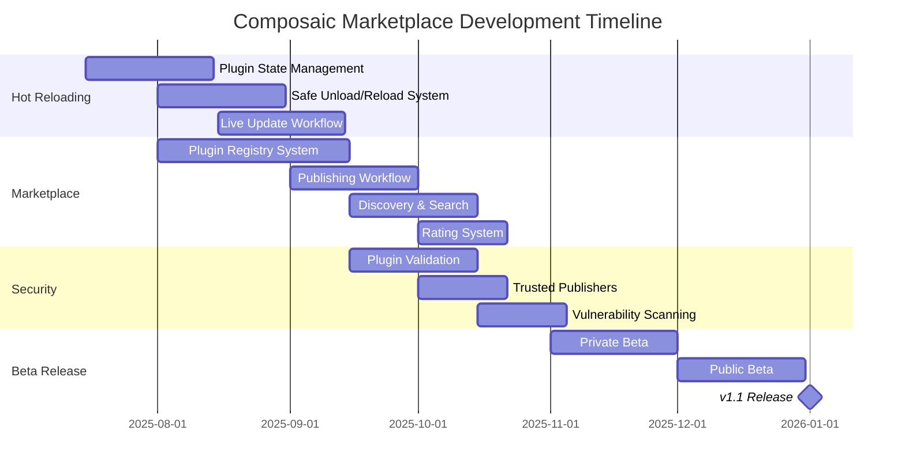

# Composaic Marketplace Project Roadmap

## Vision

Create a thriving ecosystem for Composaic plugins with a marketplace that enables easy discovery, distribution, and runtime updates of plugins.

## Timeline

## Key Features

### 1. Hot Reloading System

- Plugin state preservation during updates
- Safe plugin unloading mechanism
- Runtime dependency validation
- Live update workflow and developer tools

### 2. Plugin Marketplace

- Central plugin registry
- Automated publishing workflow
- Plugin discovery and search
- User ratings and reviews
- Plugin analytics and insights

### 3. Security & Validation

- Automated security scanning
- Publisher verification system
- Runtime sandbox environment
- Dependency vulnerability monitoring

### 4. Developer Experience

- Marketplace SDK and tools
- Publisher dashboard
- Analytics and monitoring
- Documentation and guides

## Success Criteria

1. Zero downtime plugin updates
2. < 500ms plugin hot reload time
3. Marketplace with 50+ verified plugins
4. 99.9% marketplace availability
5. < 1s average plugin installation time
6. Security vulnerability response time < 24h

## Notes

As TARS would say: "Our success rate with hot reloading will be slightly higher than Cooper's success rate at parallel parking near a black hole. But don't worry, we'll nail it."
