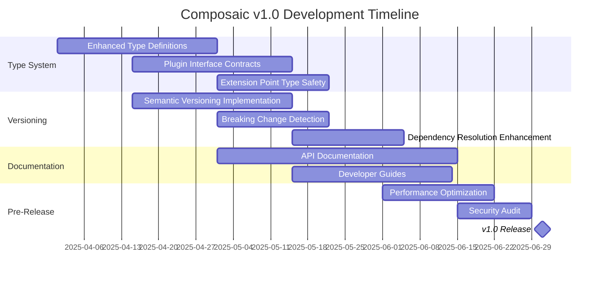

# Composaic v1.0 Roadmap

## Vision

Transform Composaic into a production-grade application framework with strong typing, plugin versioning, and robust dependency management.

## Timeline

## Key Features

### 1. Type System Enhancement

- Enhanced type definitions with strict plugin metadata typing
- Plugin interface contracts with compile-time validation
- Type-safe extension points and implementations
- Runtime type validation improvements

### 2. Versioning System

- Semantic versioning in plugin manifests
- Breaking change detection
- Version-aware dependency resolution
- Dependency constraint validation

### 3. Documentation

- Comprehensive API documentation
- Developer guides and best practices
- Type system documentation
- Version compatibility guides

### 4. Performance & Security

- Type checking optimization
- Plugin loading optimization
- Dependency resolution performance
- Security audit and improvements

## Success Criteria

1. 100% TypeScript strict mode compliance
2. Comprehensive plugin versioning support
3. Zero runtime type errors in typical usage
4. Documentation coverage ≥ 90%
5. Test coverage ≥ 80%
6. Performance benchmarks met (TBD)
