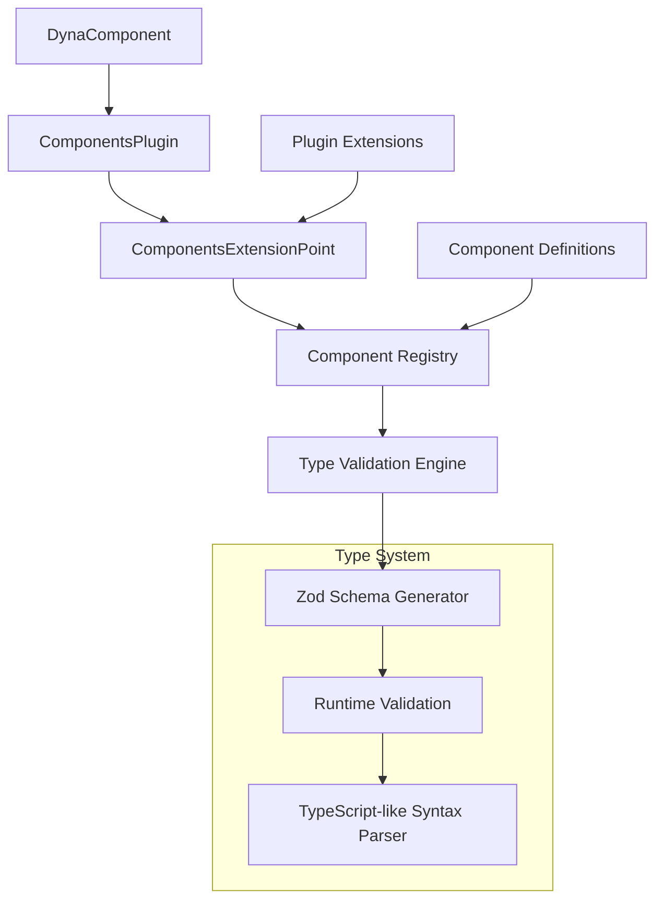

<!--
    Instructions for TARS

    1. Leave this comment section here, add your design etc after this comment
    2. You need to analyse the views plugin in web project web/src/plugins/views
    3. You will design a new extension for this plugin - examine the views extension, as the new one will follow a similar pattern:
        3.1 provide information on the implementation in meta info
        3.2 add a method into views plugin able to return component for id (just like it does for views - look for inspiration)
    4. The new extension is called component, see an example ExtensionMetadata for it:
          @ExtensionMetadata({
                plugin: '@some/plugin',
                id: 'components',
                className: 'SampleComponentExtension',
                meta: [
                     {
                          componentId: '@cool/component',
                          componentClass: 'SimpleViewsExtension',
                          properties: {
                                name: 'string',
                                age: '?string',
                                sex: 'male|female'
                          }
                     },
                ],
          })
    5. The properties are expressed with a TypeScript like syntax (don't need to go crazy like generics etc, but try to cover those types and situations that are likely for a component)
    6. In the background, you will implement a Zed based type mapping (utility) and runtime type verification (see later for DynamicComponent)
    7. Children - no idea how should we support this - come up with options
    8. Just like the views extension has a ViewComponent (under web/src/plugins/views/components and see its use in web/src/plugins/navbar/Example1Page.tsx!) we'll develop a component for app developers (call it DynaComponent) which will be the mechanism to make use of the components extension in client code (again look at ViewComponent for inspiration - the idea is very similar)
    9. We'll need a good test component as well to prove out the implementation, I'll describe what I expect from you:
    10. In ExamplePage1.tsx I mentioned to you earlier after the current contents, add a <DynaComponent/> referencing the example component
    11. In demo/applications/plugin-template/src/plugins/views add a new extension with the example plugin (come up with a simple component that takes a few properties - also make sure you have example for optional property here).
    12. Add another extension for the same components plugin using the same componentId in demo/applications/test-plugin-one/src/plugins/views (you will need to set this up as it doesn't exist, basically you can replicate the one in plugin-template, but don't need the views extension only the components one).
    13. For testing your work use the dev-build.js -b script
-->

# Dynamic Components System Architecture

## Overview

The Dynamic Components system extends the existing Views plugin architecture to enable dynamic component rendering with type-safe property validation. This system allows plugins to register reusable components that can be dynamically loaded and rendered with runtime type checking.

## Architecture Design

### 1. Core Components Extension Point



### 2. Component Definition Structure

Based on the provided example, each component will be defined with:

```typescript
export type ComponentDefinition = {
    componentId: string; // Unique identifier like '@cool/component'
    componentClass: string; // React component class name
    properties: ComponentProperties; // Type definitions
    plugin: string; // Source plugin identifier
};

export type ComponentProperties = {
    [key: string]: PropertyType;
};

export type PropertyType =
    | 'string'
    | 'number'
    | 'boolean'
    | 'object'
    | 'array'
    | `?${PropertyType}` // Optional properties
    | `${string}|${string}` // Union types like 'male|female'
    | `${PropertyType}[]`; // Array types
```

### 3. Components Plugin Architecture

The `ComponentsPlugin` will follow the same pattern as `ViewsPlugin`:

````typescript
@PluginMetadata({
    plugin: '@composaic/components',
    version: '0.1.0',
    description: 'Dynamic Components Plugin',
    module: 'index',
    package: 'components',
    extensionPoints: [
        {
            id: 'components',
            type: 'ComponentsExtensionPoint',
        },
    ],
})
export class ComponentsPlugin extends Plugin {
    private componentDefinitions: ComponentDefinition[] = [];
    private typeValidator: ComponentTypeValidator;

    async start() {
        await this.initializeComponents();
    }

    private async initializeComponents() {
        // Collect component definitions from all connected extensions
        const extensions = this.getConnectedExtensions('components');

        extensions.forEach((extension) => {
            const componentMeta = extension.meta! as ComponentDefinition[];
            for (const component of componentMeta) {
                component.plugin = extension.plugin;
                this.componentDefinitions.push(component);
            }
        });
    }

    public getComponentById(
        componentId: string
    ): ComponentDefinition | undefined {
        return this.componentDefinitions.find(
            (def) => def.componentId === componentId
        );
    }

    public validateProps(componentId: string, props: any): ValidationResult {
        const component = this.getComponentById(componentId);
        if (!component) {
            throw new Error(`Component not found: ${componentId}`);
        }

        return this.typeValidator.validate(component.properties, props);
    }
}
### 3.1 Handling Late-Initializing Plugins

**Critical Enhancement**: The `DynaComponent` must use the plugin change listener mechanism to handle late-initializing plugins, just like the `ViewComponent` does:

```typescript
// In DynaComponent.tsx - Plugin change listener implementation
useEffect(() => {
  if (!componentId) return;

  const unsubscribe = PluginManager.getInstance().registerPluginChangeListener(
    ['@composaic/components'], // Listen for components plugin changes
    () => {
      // When plugins change, force component reload
      console.log('[DynaComponent] Plugin change detected, reloading component');
      setComponent(null);
      setLoading(true);
      setError(null);
    }
  );

  return () => {
    unsubscribe();
  };
}, [componentId]);
````

**Why This Is Essential**:

1. **Late Plugin Loading**: Some plugins may initialize after the DynaComponent mounts
2. **Dynamic Plugin Updates**: Plugins can be loaded/unloaded at runtime
3. **Component Discovery**: New component definitions may become available after initial load
4. **Consistency**: Maintains the same behavior pattern as the existing ViewComponent

This listener mechanism ensures that:

- Components can be discovered even if their defining plugins load late
- The UI updates automatically when new component definitions become available
- The system remains responsive to plugin lifecycle changes
- Error states are properly cleared when plugins become available

````

### 4. Type Validation System

#### 4.1 TypeScript-like Syntax Parser

```typescript
export class TypeScriptSyntaxParser {
    static parsePropertyType(typeString: string): ZodSchema {
        // Handle optional properties
        if (typeString.startsWith('?')) {
            return this.parsePropertyType(typeString.slice(1)).optional();
        }

        // Handle union types
        if (typeString.includes('|')) {
            const unionTypes = typeString.split('|');
            return z.union(
                unionTypes.map((type) => this.parseBasicType(type.trim()))
            );
        }

        // Handle array types
        if (typeString.endsWith('[]')) {
            const elementType = typeString.slice(0, -2);
            return z.array(this.parsePropertyType(elementType));
        }

        return this.parseBasicType(typeString);
    }

    private static parseBasicType(type: string): ZodSchema {
        switch (type) {
            case 'string':
                return z.string();
            case 'number':
                return z.number();
            case 'boolean':
                return z.boolean();
            case 'object':
                return z.object({});
            case 'array':
                return z.array(z.unknown());
            default:
                // Handle literal union types like 'male|female'
                return z.literal(type);
        }
    }
}
````

#### 4.2 Component Type Validator

```typescript
export class ComponentTypeValidator {
    validate(properties: ComponentProperties, props: any): ValidationResult {
        const schema = this.generateZodSchema(properties);

        try {
            const validatedProps = schema.parse(props);
            return { success: true, data: validatedProps };
        } catch (error) {
            return { success: false, error: error.message };
        }
    }

    private generateZodSchema(properties: ComponentProperties): ZodSchema {
        const schemaObject: Record<string, ZodSchema> = {};

        for (const [key, typeString] of Object.entries(properties)) {
            schemaObject[key] =
                TypeScriptSyntaxParser.parsePropertyType(typeString);
        }

        return z.object(schemaObject);
    }
}
```

### 5. DynaComponent Implementation

The `DynaComponent` will be the React component that app developers use to render dynamic components:

```typescript
interface DynaComponentProps {
 componentId: string;
 props?: Record<string, any>;
 children?: React.ReactNode;
 fallback?: React.ComponentType<{ error: string }>;
}

export const DynaComponent: React.FC<DynaComponentProps> = ({
 componentId,
 props = {},
 children,
 fallback: Fallback,
}) => {
 const [Component, setComponent] = useState<React.FC | null>(null);
 const [loading, setLoading] = useState(true);
 const [error, setError] = useState<string | null>(null);

 useEffect(() => {
   let isMounted = true;

   async function loadComponent() {
     try {
       setLoading(true);
       setError(null);

       const componentsPlugin = await PluginManager.getInstance()
         .getPlugin('@composaic/components') as ComponentsPlugin;

       if (!componentsPlugin) {
         throw new Error('Components plugin not found');
       }

       // Get component definition
       const componentDef = componentsPlugin.getComponentById(componentId);
       if (!componentDef) {
         throw new Error(`Component not found: ${componentId}`);
       }

       // Validate props
       const validation = componentsPlugin.validateProps(componentId, props);
       if (!validation.success) {
         throw new Error(`Invalid props: ${validation.error}`);
       }

       // Load the actual React component
       const pluginInstance = await PluginManager.getInstance()
         .getPlugin(componentDef.plugin);

       const ComponentToRender = pluginInstance.getModule(
         componentDef.componentClass
       ) as React.FC;

       if (!ComponentToRender) {
         throw new Error(`Component class not found: ${componentDef.componentClass}`);
       }

       if (isMounted) {
         setComponent(() => ComponentToRender);
       }
     } catch (err) {
       if (isMounted) {
         setError(err.message);
       }
     } finally {
       if (isMounted) {
         setLoading(false);
       }
     }
   }

   loadComponent();

   return () => {
     isMounted = false;
   };
 }, [componentId, props]);

 if (loading) {
   return <div>Loading component...</div>;
 }

 if (error) {
   if (Fallback) {
     return <Fallback error={error} />;
   }
   return <div>Error loading component: {error}</div>;
 }

 if (!Component) {
   return null;
 }

 return <Component {...props}>{children}</Component>;
};
```

### 6. Children Handling Options

For handling children in dynamic components, I propose three approaches:

#### Option 1: Simple Children Pass-through (Recommended)

- Children are passed directly to the component as `props.children`
- Simple and follows React conventions
- Type validation can specify `children?: ReactNode`

#### Option 2: Named Slots System

- Similar to Vue.js slots or Angular content projection
- Children with specific `slot` attributes are distributed to named slots
- More complex but provides better control over child placement

#### Option 3: Render Props Pattern

- Components can specify render prop functions in their type definitions
- Allows for more dynamic child rendering scenarios
- Higher complexity but maximum flexibility

**Recommendation**: Start with Option 1 for simplicity and add slot support later if needed.

### 7. Example Implementation

#### 7.1 Sample Component Extension

```typescript
// In demo/applications/plugin-template/src/plugins/views/index.ts

@ExtensionMetadata({
    plugin: '@demo/plugin-template',
    id: 'components',
    className: 'SampleComponentExtension',
    meta: [
        {
            componentId: '@demo/user-card',
            componentClass: 'UserCardComponent',
            properties: {
                name: 'string',
                age: '?number',
                role: 'admin|user|guest',
                tags: 'string[]',
                isActive: 'boolean',
            },
        },
    ],
})
export class SampleComponentExtension implements ComponentsExtensionPoint {
    getComponentDefinitions(): ComponentDefinition[] {
        return [
            {
                componentId: '@demo/user-card',
                componentClass: 'UserCardComponent',
                properties: {
                    name: 'string',
                    age: '?number',
                    role: 'admin|user|guest',
                    tags: 'string[]',
                    isActive: 'boolean',
                },
                plugin: '@demo/plugin-template',
            },
        ];
    }
}
```

#### 7.2 UserCardComponent Implementation

```typescript
// UserCardComponent.tsx
interface UserCardProps {
 name: string;
 age?: number;
 role: 'admin' | 'user' | 'guest';
 tags: string[];
 isActive: boolean;
 children?: React.ReactNode;
}

export const UserCardComponent: React.FC<UserCardProps> = ({
 name,
 age,
 role,
 tags,
 isActive,
 children
}) => {
 return (
   <div className={`user-card ${isActive ? 'active' : 'inactive'}`}>
     <h3>{name}</h3>
     {age && <p>Age: {age}</p>}
     <span className={`role-badge ${role}`}>{role}</span>
     <div className="tags">
       {tags.map(tag => <span key={tag} className="tag">{tag}</span>)}
     </div>
     {children}
   </div>
 );
};
```

#### 7.3 Usage in Example1Page.tsx

```typescript
// In web/src/plugins/navbar/Example1Page.tsx
import { DynaComponent } from '../views/components/DynaComponent';

export const Example1Page: React.FC = () => {
 return (
   <>
     <div>New Example</div>
     <div>
       <ViewComponent id="sample.container">
         <ViewComponent slot="master" />
         <ViewComponent slot="detail" />
       </ViewComponent>
     </div>

     {/* New DynaComponent usage */}
     <div>
       <h2>Dynamic Component Example</h2>
       <DynaComponent
         componentId="@demo/user-card"
         props={{
           name: "John Doe",
           age: 30,
           role: "admin",
           tags: ["developer", "typescript"],
           isActive: true
         }}
       >
         <p>This is child content passed to the component</p>
       </DynaComponent>
     </div>
   </>
 );
};
```

### 8. File Structure

```
web/src/plugins/components/
├── index.ts                          # ComponentsPlugin & extension point
├── components/
│   ├── DynaComponent.tsx            # Main component for developers
│   └── ComponentContext.tsx         # Context for component communication
├── validation/
│   ├── TypeScriptSyntaxParser.ts    # Parses TS-like syntax to Zod
│   ├── ComponentTypeValidator.ts    # Validates component props
│   └── types.ts                     # Type definitions
└── components-plugin.json           # Plugin manifest

demo/applications/plugin-template/src/plugins/components/
├── index.ts                         # Sample extension implementation
├── UserCardComponent.tsx            # Example component
└── UserCardComponent.scss           # Component styles

demo/applications/test-plugin-one/src/plugins/components/
├── index.ts                         # Second extension for testing
└── AnotherUserCardComponent.tsx     # Alternative implementation
```

### 9. Testing Strategy

1. **Unit Tests**:

- TypeScript syntax parser
- Zod schema generation
- Component validation logic

2. **Integration Tests**:

- Plugin loading and registration
- Component discovery and instantiation
- Property validation scenarios

3. **End-to-End Tests**:

- Full component rendering pipeline
- Error handling and fallbacks
- Multiple plugin scenario

4. **Development Testing**:

- Use `scripts/dev-build.js -b` to rebuild and test
- Test both plugin-template and test-plugin-one implementations

### 10. Implementation Plan

1. **Phase 1**: Core Infrastructure

- Create ComponentsPlugin with basic registry
- Implement TypeScript syntax parser
- Create Zod-based validation system

2. **Phase 2**: Component System

- Implement DynaComponent React component
- Add component loading and caching
- Implement error handling and fallbacks

3. **Phase 3**: Example Components

- Create UserCardComponent in plugin-template
- Set up test-plugin-one with alternative implementation
- Update Example1Page with DynaComponent usage

4. **Phase 4**: Testing & Refinement

- Add comprehensive test suite
- Performance optimization
- Documentation and examples

This architecture provides a robust, type-safe, and extensible dynamic component system that follows the established patterns in the codebase while adding powerful new capabilities for component reuse and validation.
